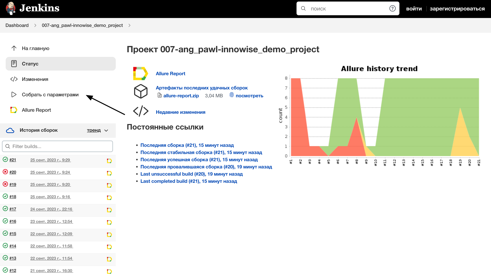
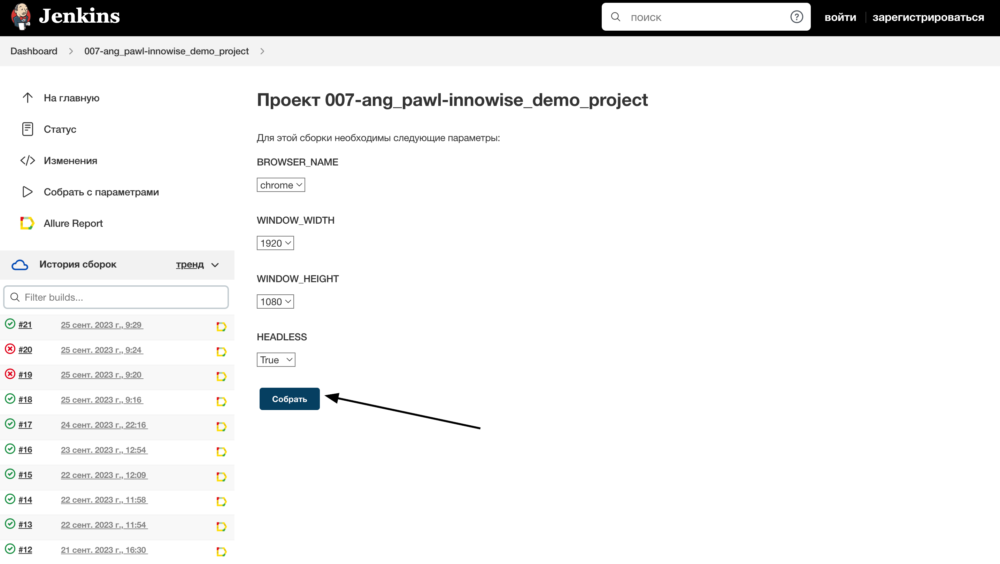
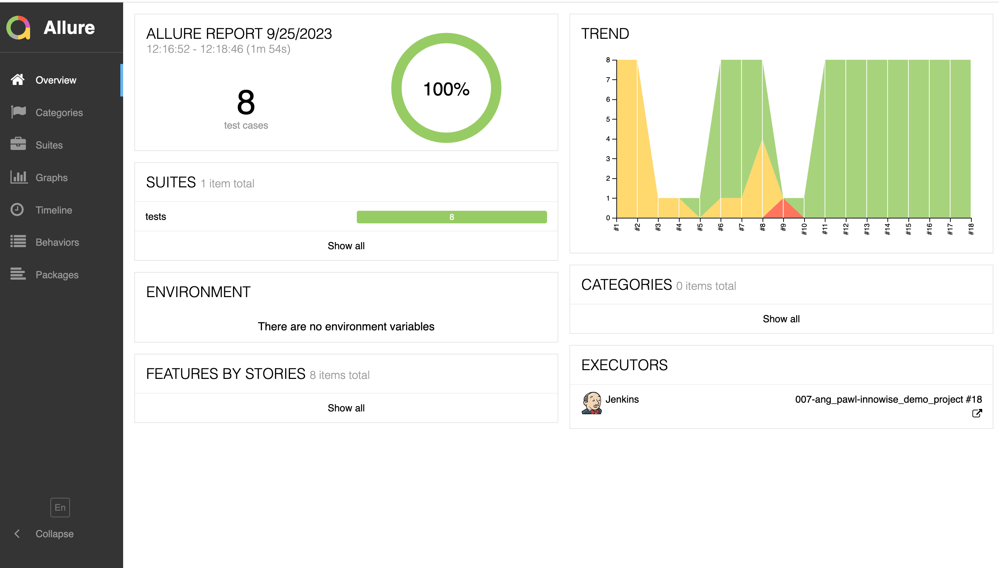
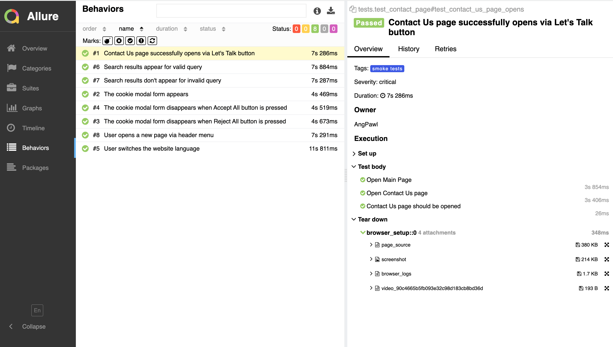
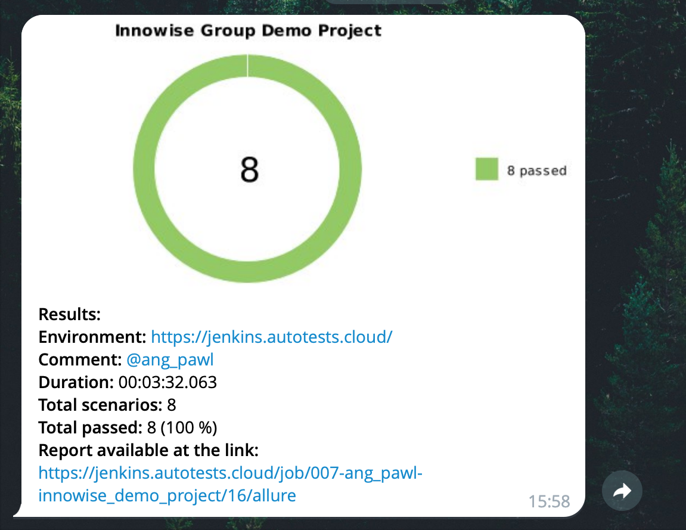
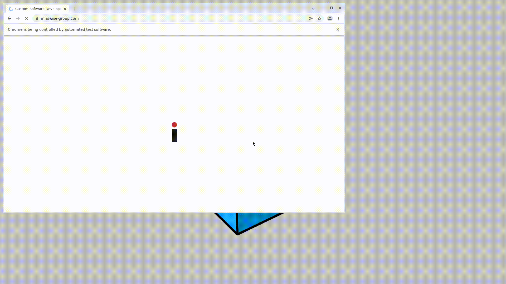

# Демонстрационный проект по тестированию главной страницы сайта компании <a target="_blank" href="https://innowise-group.com/">Innowise Group</a>


### Стек технологий:
<code></code>
<code></code>
<code></code>
<code></code>
<code></code>
<code></code>
<code></code>
<code></code>

### Реализованные проверки:
- Страница Contact Us успешно открывается при клике на кнопку Let's Talk
- Предупреждение о сборе cookies:
  - Присутствует на странице
  - Успешно пропадает после клика на кнопку Reject All
  - Успешно пропадает после клика на кнопку Accept All
- Переключение языка сайта на другой язык осуществляется успешно
- Поиск по сайту:
  - Выдает результаты по валидному запросу
  - Не выдает результаты по невалидному запросу
- Успешно открывается страница раздела сайта 

### Для локального запуска автотестов необходимо:

1. Склонировать репозиторий
2. Установить python интерпретатор
2. Установить зависимости из файла requirements.txt
4. Создайть `.env` файл по образцу в корневой папке проекта
5. Запустить тесты в командной строке:

```bash
pytest .
```

### Удаленный запуск автотестов производится на сервере <a target="_blank" href="https://selenoid.autotests.cloud/#/">Selenoid</a> при помощи созданной в Jenkins <a target="_blank" href="https://jenkins.autotests.cloud/job/007-ang_pawl-innowise_demo_project/">джобы</a>.

### Для удаленного запуска автотестов необходимо:
- Открыть подготовленную <a target="_blank" href="https://jenkins.autotests.cloud/job/007-ang_pawl-innowise_demo_project/">джобу</a> в Jenkins
- Нажать "Собрать с параметрами" в боковом меню
- После выбора параметров нажать "Собрать"




### Можно задать следующие параметры:
- BROWSER_NAME (браузер, в котором запустятся тесты): chrome, firefox
- WINDOW_WIDTH (ширину экрана): 1920, 1366
- WINDOW_HEIGHT (высоту экрана): 1080, 768
- HEADLESS (запуск браузера без графического интерфейса либо с ним): True, False

#### *После прохождения автотестов можно зайти в Allure Report и посмотреть отчет по тестовому прогону:*



#### *Также можно подробно посмотреть результат прохождения каждого отдельного теста:*



### Для мгновенного получения результатов о тестировании настроено автоматическое оповещение через Telegram.


### Ниже на видео представлен пример короткого теста на сервере <a target="_blank" href="https://selenoid.autotests.cloud/#/">Selenoid</a>.


